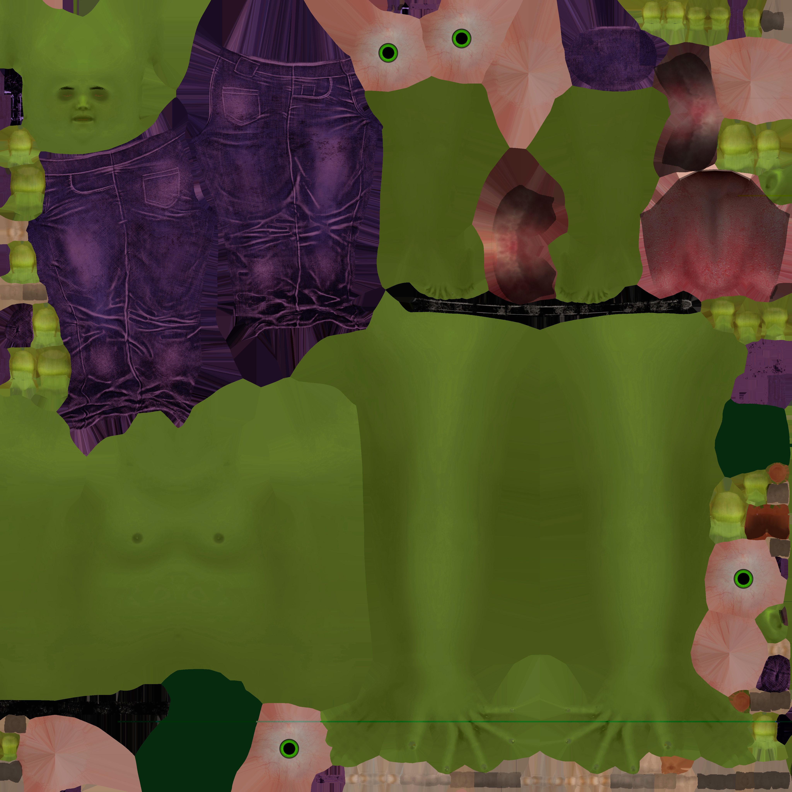
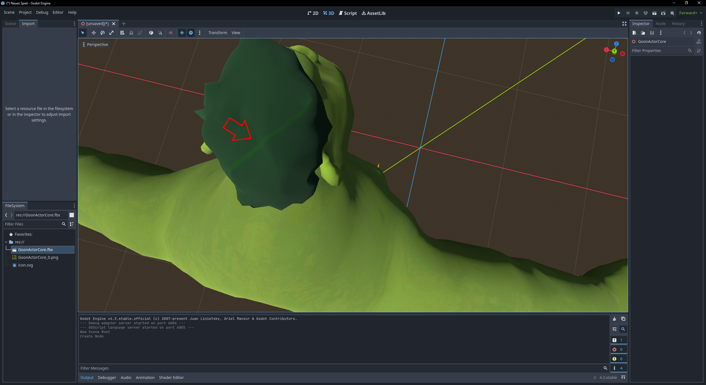
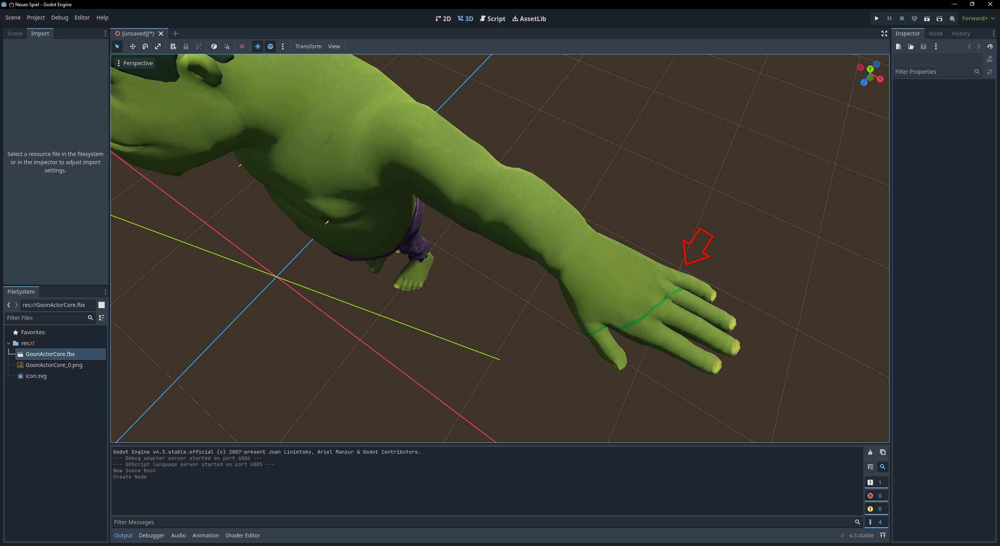

# UFBX base64 decoding bug

To switch between the original `ufbx.c` source code and a fixed version of the source code `ufbx_fixed.c`,  
you can comment/uncomment one of the following two lines in `main.c`
```
#include "ufbx.c"       // (base64 BUGGED) <--- original ufbx base64 decoding
// #include "ufbx_fixed.c" // (base64 FIXED)  <--- fixed base64 decoding (see Assimp FBX import code)
```

#### Notes

* The base64 decoding bug in ufbx leads to corrupted/malformed binary blobs when decoding FBX embedded textures.
* In the example of the embedded .jpeg textures, the extracted JPEG blob might still be decoded by some JPEG decoding libraries (like libjpeg)  
  but the decoded image will show severe or subtle texture artifacts.
* [stb_image](https://github.com/nothings/stb/blob/master/stb_image.h) sometimes even fails to decode the corrupted JPEG blob entirely,  
  which might lead to no textures being shown for the .fbx in your 3D engine/app.

#### BUGGED vs. FIXED Diffuse .jpg
> notice the 1px green horizontal line at the very bottom in the diffuse image

<a href="Character_Diffuse_BAD.jpg"></a> <a href="Character_Diffuse_GOOD.jpg"></a>

#### BUGGED vs. FIXED Normals .jpg
> notice the misaligned encoding blocks and random color shifts in the normal image

<a href="Character_Normal_BAD.jpg"></a> <a href="Character_Normal_GOOD.jpg"></a>

#### The same bug in Godot 4.3 with ufbx import
> you can see the 1px green horizontal line on the hands & hair of the character

<a href="Godot_4.3_Jpeg_Issue_GoonHair.png"></a> <a href="Godot_4.3_Jpeg_Issue_GoonHand.png"></a>

#### References

* [download the free "Toon Goon" fbx model from sketchfab](https://sketchfab.com/3d-models/facial-body-animated-toon-goon-actorcore-5ed2a2ed8299441ebbaa2f3ef2b7d226)
* [ufbx Github](https://github.com/ufbx/ufbx)
* [assimp Github](https://github.com/assimp/assimp)
  * see [code/AssetLib/FBX/FBXMaterial.cpp](https://github.com/assimp/assimp/blob/b58afb7b83ed6e27b9dd0554512795f560d6c891/code/AssetLib/FBX/FBXMaterial.cpp#L305-L339)
  * see [code/AssetLib/FBX/FBXUtil.cpp](https://github.com/assimp/assimp/blob/b58afb7b83ed6e27b9dd0554512795f560d6c891/code/AssetLib/FBX/FBXUtil.cpp#L115-L181)
* [stb_image Github](https://github.com/nothings/stb/blob/master/stb_image.h)
* [Godot 4.3](https://godotengine.org/download)
